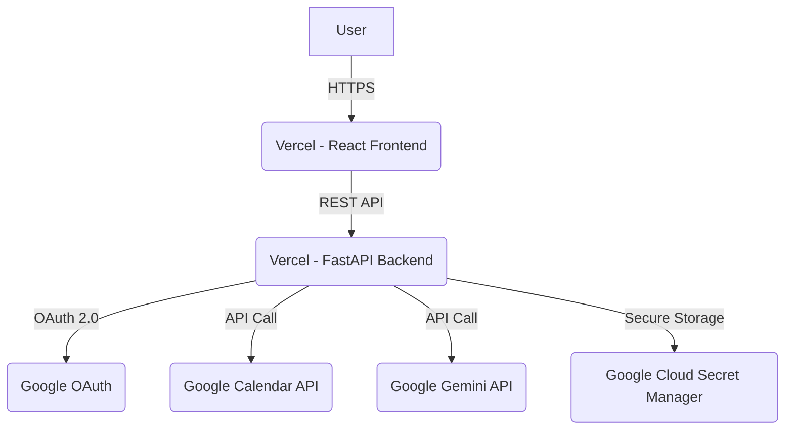
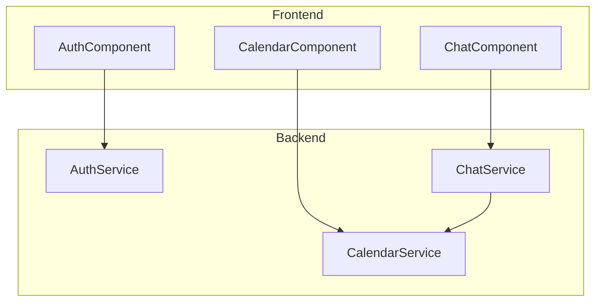
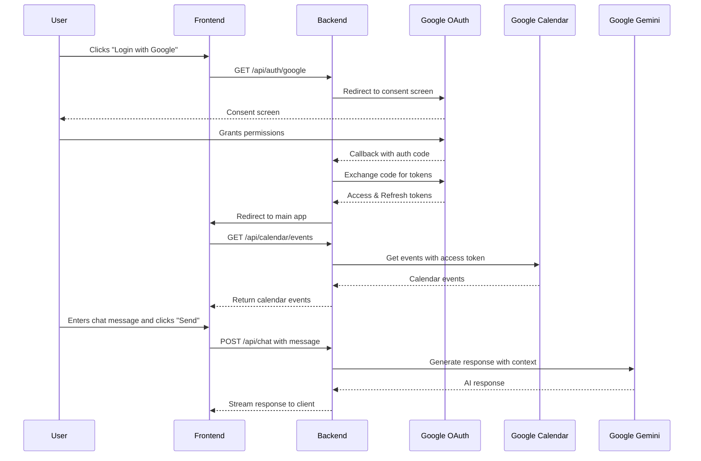
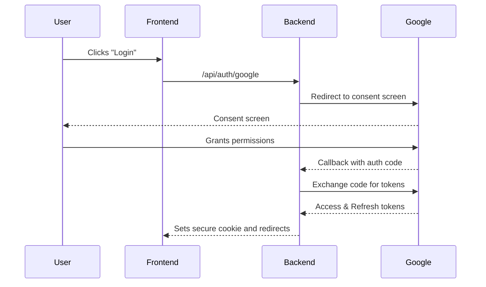
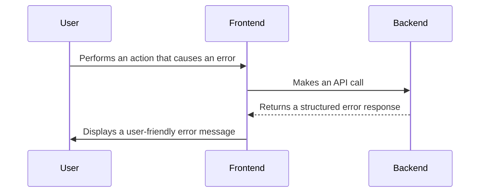

# Fullstack Architecture Document

## Introduction
This document outlines the complete fullstack architecture for cal agent, including backend systems, frontend implementation, and their integration. It serves as the single source of truth for AI-driven development, ensuring consistency across the entire technology stack.

This unified approach combines what would traditionally be separate backend and frontend architecture documents, streamlining the development process for modern fullstack applications where these concerns are increasingly intertwined.

### Starter Template or Existing Project
N/A - Greenfield project. The technology stack and monorepo structure are defined in the PRD.

### Change Log
| Date | Version | Description | Author |
| :--- | :--- | :--- | :--- |
| 2025-09-02 | 1.0 | Initial draft of the architecture document. | Winston (Architect) |

## High Level Architecture

### Technical Summary
The "cal agent" project will be a full-stack application with a decoupled front-end and back-end, deployed on a serverless infrastructure to meet the NFR of minimal budget. The front-end will be a React application using Material-UI, and the back-end will be a Python application using the FastAPI framework. The key integration point is a REST API that the front-end will use to communicate with the back-end for authentication, calendar data, and chat functionality. The entire application will be hosted on Vercel, which provides a seamless deployment experience for Next.js/React front-ends and serverless back-end functions. This architecture directly supports the PRD goals by demonstrating proficiency in modern, decoupled web architectures, API design, and AI integration.

### Platform and Infrastructure Choice
**Platform:** Vercel
**Key Services:** Vercel for hosting the front-end and serverless back-end, Google Cloud Secret Manager for storing refresh tokens.
**Deployment Host and Regions:** Vercel's standard CDN and serverless functions deployed in a single region (e.g., `us-east-1`).

### Repository Structure
**Structure:** Monorepo
**Monorepo Tool:** Turborepo
**Package Organization:** The monorepo will contain `apps/web` for the React front-end, `apps/api` for the FastAPI back-end, and `packages/shared` for shared TypeScript types.

### High Level Architecture Diagram


### Architectural Patterns
- **Serverless Architecture:** The backend will be deployed as serverless functions on Vercel. _Rationale:_ This aligns with the NFR of minimal budget by using a pay-per-use model and simplifies deployment and scaling.
- **Component-Based UI:** The React front-end will be built using reusable components with Material-UI. _Rationale:_ This promotes maintainability, consistency, and faster development.
- **API Gateway Pattern:** The FastAPI application will act as a single entry point for all API calls from the front-end. _Rationale:_ This centralizes authentication, request handling, and provides a clear contract between the front-end and back-end.

## Tech Stack

### Technology Stack Table

| Category | Technology | Version | Purpose | Rationale |
| :--- | :--- | :--- | :--- | :--- |
| Frontend Language | TypeScript | latest | Type safety for the frontend | Reduces errors and improves developer experience. |
| Frontend Framework | React | 18.x | Building the user interface | The most popular and widely used UI framework. |
| UI Component Library| Material-UI | 5.x | UI components | Provides a professional and polished look and feel. |
| State Management | React Context | 18.x | Managing global state | Sufficient for this project's needs without adding a library. |
| Backend Language | Python | 3.11+ | Backend logic | A versatile and popular language for web backends and AI. |
| Backend Framework | FastAPI | latest | Building the backend API | A modern, high-performance Python web framework. |
| API Style | REST | N/A | Communication between frontend and backend | A simple and well-understood API style. |
| Database | None | N/A | Data storage | Not required for the MVP. |
| Cache | None | N/A | Caching data | Not required for the MVP. |
| File Storage | None | N/A | Storing files | Not required for the MVP. |
| Authentication | Google OAuth 2.0 | v2 | User authentication | Required to access Google Calendar data. |
| Frontend Testing | Jest & React Testing Library | latest | Unit and component testing | Standard testing tools for React applications. |
| Backend Testing | Pytest | latest | Unit and integration testing | The standard testing framework for Python. |
| E2E Testing | None | N/A | End-to-end testing | Not required for this demo project. |
| Build Tool | Vite | latest | Frontend build tool | A fast and modern build tool for React applications. |
| Bundler | Vite | latest | Bundling the frontend | Integrated with the build tool. |
| IaC Tool | None | N/A | Infrastructure as Code | Not required as we are using Vercel's managed platform. |
| CI/CD | Vercel | N/A | Continuous integration and deployment | Vercel provides a seamless CI/CD pipeline for Next.js/React. |
| Monitoring | Vercel Analytics | N/A | Monitoring application performance | Built-in to the Vercel platform. |
| Logging | Vercel Logs | N/A | Logging application events | Built-in to the Vercel platform. |
| CSS Framework | Material-UI (JSS) | 5.x | Styling the application | Integrated with the component library. |

## Data Models

### User
**Purpose:** Represents the authenticated user.

**Key Attributes:**
- `id`: `string` - The user's unique Google ID.
- `email`: `string` - The user's email address.
- `name`: `string` - The user's full name.
- `picture`: `string` - URL to the user's profile picture.

**TypeScript Interface:**
```typescript
interface User {
  id: string;
  email: string;
  name: string;
  picture: string;
}
```

**Relationships:**
- A User has many CalendarEvents.

### CalendarEvent
**Purpose:** Represents a single event from the user's Google Calendar.

**Key Attributes:**
- `id`: `string` - The unique ID of the event.
- `summary`: `string` - The title of the event.
- `start`: `Date` - The start date and time of the event.
- `end`: `Date` - The end date and time of the event.
- `description`: `string | null` - The description of the event.

**TypeScript Interface:**
```typescript
interface CalendarEvent {
  id: string;
  summary: string;
  start: Date;
  end: Date;
  description: string | null;
}
```

**Relationships:**
- Belongs to a User.

### ChatMessage
**Purpose:** Represents a single message in the chat interface.

**Key Attributes:**
- `id`: `string` - A unique ID for the message.
- `text`: `string` - The content of the message.
- `sender`: `'user' | 'agent'` - Who sent the message.
- `timestamp`: `Date` - When the message was sent.

**TypeScript Interface:**
```typescript
interface ChatMessage {
  id: string;
  text: string;
  sender: 'user' | 'agent';
  timestamp: Date;
}
```

**Relationships:**
- None.

## API Specification

This is a REST API, and the specification is defined using the OpenAPI 3.0 standard.

```yaml
openapi: 3.0.0
info:
  title: cal agent API
  version: 1.0.0
  description: The API for the cal agent application.
servers:
  - url: /api
    description: The base path for the API.

paths:
  /auth/google:
    get:
      summary: Initiate Google OAuth flow
      responses:
        '302':
          description: Redirects to Google's OAuth consent screen.

  /auth/google/callback:
    get:
      summary: Handle Google OAuth callback
      responses:
        '302':
          description: Redirects to the frontend application after successful login.

  /auth/logout:
    post:
      summary: Log out the current user
      responses:
        '200':
          description: Successfully logged out.

  /users/me:
    get:
      summary: Get the current user
      responses:
        '200':
          description: The current user's information.
          content:
            application/json:
              schema:
                $ref: '#/components/schemas/User'
        '401':
          description: Unauthorized.

  /calendar/events:
    get:
      summary: Get calendar events
      responses:
        '200':
          description: A list of calendar events.
          content:
            application/json:
              schema:
                type: array
                items:
                  $ref: '#/components/schemas/CalendarEvent'
        '401':
          description: Unauthorized.

  /chat:
    post:
      summary: Send a chat message
      requestBody:
        required: true
        content:
          application/json:
            schema:
              type: object
              properties:
                message:
                  type: string
      responses:
        '200':
          description: The agent's response.
          content:
            application/json:
              schema:
                $ref: '#/components/schemas/ChatMessage'
        '401':
          description: Unauthorized.

components:
  schemas:
    User:
      type: object
      properties:
        id:
          type: string
        email:
          type: string
        name:
          type: string
        picture:
          type: string

    CalendarEvent:
      type: object
      properties:
        id:
          type: string
        summary:
          type: string
        start:
          type: string
          format: date-time
        end:
          type: string
          format: date-time
        description:
          type: string

    ChatMessage:
      type: object
      properties:
        id:
          type: string
        text:
          type: string
        sender:
          type: string
          enum: [user, agent]
        timestamp:
          type: string
          format: date-time
```

## Components

### Frontend: AuthComponent
**Responsibility:** Manages the user's authentication state and provides the login/logout UI.
**Key Interfaces:** Renders a "Login with Google" button or a "Logout" button depending on the user's auth state.
**Dependencies:** `Backend: AuthService`
**Technology Stack:** React, Material-UI

### Frontend: CalendarComponent
**Responsibility:** Fetches and displays the user's calendar events.
**Key Interfaces:** Renders a calendar view.
**Dependencies:** `Backend: CalendarService`
**Technology Stack:** React, Material-UI

### Frontend: ChatComponent
**Responsibility:** Provides the main chat interface for the user to interact with the agent.
**Key Interfaces:** Renders the chat history, a text input, and a send button.
**Dependencies:** `Backend: ChatService`
**Technology Stack:** React, Material-UI

### Backend: AuthService
**Responsibility:** Handles the Google OAuth 2.0 flow, manages user sessions, and securely stores refresh tokens.
**Key Interfaces:** Exposes the `/auth/google`, `/auth/google/callback`, and `/auth/logout` endpoints.
**Dependencies:** Google OAuth, Google Cloud Secret Manager
**Technology Stack:** FastAPI

### Backend: CalendarService
**Responsibility:** Fetches calendar events from the Google Calendar API using the user's stored credentials.
**Key Interfaces:** Exposes the `/calendar/events` endpoint.
**Dependencies:** Google Calendar API
**Technology Stack:** FastAPI

### Backend: ChatService
**Responsibility:** Takes user input, combines it with calendar data, and interacts with the Google Gemini LLM to generate a response.
**Key Interfaces:** Exposes the `/chat` endpoint.
**Dependencies:** Google Gemini API, `Backend: CalendarService`
**Technology Stack:** FastAPI

### Component Diagram


## External APIs

### Google OAuth 2.0 API
- **Purpose:** To authenticate users and get their consent to access their Google Calendar data.
- **Documentation:** [https://developers.google.com/identity/protocols/oauth2](https://developers.google.com/identity/protocols/oauth2)
- **Base URL(s):** `https://accounts.google.com/o/oauth2/v2/auth`, `https://oauth2.googleapis.com/token`
- **Authentication:** OAuth 2.0
- **Rate Limits:** Standard Google API rate limits apply.

**Key Endpoints Used:**
- `GET https://accounts.google.com/o/oauth2/v2/auth` - To redirect the user to the consent screen.
- `POST https://oauth2.googleapis.com/token` - To exchange an authorization code for an access token and refresh token.

**Integration Notes:** The backend will securely store the refresh token in Google Cloud Secret Manager.

### Google Calendar API
- **Purpose:** To fetch calendar events for the authenticated user.
- **Documentation:** [https://developers.google.com/calendar/api/v3/reference](https://developers.google.com/calendar/api/v3/reference)
- **Base URL(s):** `https://www.googleapis.com/calendar/v3`
- **Authentication:** OAuth 2.0 with an access token obtained via the Google OAuth 2.0 API.
- **Rate Limits:** Standard Google API rate limits apply.

**Key Endpoints Used:**
- `GET /calendars/primary/events` - To get events from the user's primary calendar.

**Integration Notes:** The backend will use the stored refresh token to get a fresh access token before making calls to this API.

### Google Gemini API
- **Purpose:** To provide the AI-powered chat functionality.
- **Documentation:** [https://ai.google.dev/docs](https://ai.google.dev/docs)
- **Base URL(s):** `https://generativelanguage.googleapis.com`
- **Authentication:** API Key
- **Rate Limits:** Free tier limits apply.

**Key Endpoints Used:**
- `POST /v1beta/models/gemini-pro:generateContent` - To generate a response from the LLM.

**Integration Notes:** The backend will construct a prompt that includes the user's message and their calendar data to provide context to the LLM.

## Core Workflows

This diagram shows the sequence of events for a new user authenticating and interacting with the chat agent for the first time.



## Database Schema
Based on the technology stack decisions, a database is not required for the MVP of this project. All data is fetched from the Google Calendar API on demand and is not stored in a persistent database.

## Frontend Architecture

### Component Architecture

#### Component Organization
```
src/
├── components/
│   ├── common/
│   │   ├── Button.tsx
│   │   └── Loading.tsx
│   ├── auth/
│   │   └── Login.tsx
│   ├── calendar/
│   │   └── CalendarView.tsx
│   └── chat/
│       └── ChatWindow.tsx
└── pages/
    ├── LoginPage.tsx
    └── MainPage.tsx
```

#### Component Template
```typescript
import React from 'react';

interface MyComponentProps {
  // component props
}

const MyComponent: React.FC<MyComponentProps> = (props) => {
  // component logic
  return (
    <div>
      {/* component JSX */}
    </div>
  );
};

export default MyComponent;
```

### State Management Architecture

#### State Structure
```typescript
interface AppState {
  isAuthenticated: boolean;
  user: User | null;
  calendarEvents: CalendarEvent[];
  chatMessages: ChatMessage[];
}
```

#### State Management Patterns
- **React Context:** A single, global context will be used to store the application state.
- **Reducer Hook:** A `useReducer` hook will be used to manage state transitions in a predictable way.

### Routing Architecture

#### Route Organization
- `/login`: The login page, accessible to unauthenticated users.
- `/`: The main application page, accessible only to authenticated users.

#### Protected Route Pattern
```typescript
import React from 'react';
import { Navigate } from 'react-router-dom';
import { useAppContext } from './AppContext';

const ProtectedRoute: React.FC<{ children: React.ReactNode }> = ({ children }) => {
  const { state } = useAppContext();

  if (!state.isAuthenticated) {
    return <Navigate to="/login" />;
  }

  return <>{children}</>;
};

export default ProtectedRoute;
```

### Frontend Services Layer

#### API Client Setup
```typescript
import axios from 'axios';

const apiClient = axios.create({
  baseURL: '/api',
  withCredentials: true, // to send cookies
});

export default apiClient;
```

#### Service Example
```typescript
import apiClient from './apiClient';

export const getCalendarEvents = async (): Promise<CalendarEvent[]> => {
  const response = await apiClient.get('/calendar/events');
  return response.data;
};
```

## Backend Architecture

### Service Architecture

#### Serverless Architecture

##### Function Organization
```
api/
├── index.py            # Main entry point for the FastAPI app
├── auth/
│   └── routes.py       # Authentication routes
├── calendar/
│   └── routes.py       # Calendar routes
├── chat/
│   └── routes.py       # Chat routes
└── core/
    ├── security.py     # Security-related functions
    └── services.py     # Business logic
```

##### Function Template
```python
from fastapi import APIRouter

router = APIRouter()

@router.get("/my-endpoint")
async def my_endpoint():
    # function logic
    return {"message": "Hello from my endpoint"}
```

### Database Architecture
As stated previously, a database is not required for the MVP of this project.

### Authentication and Authorization

#### Auth Flow


##### Middleware/Guards
```python
from fastapi import Request, Depends, HTTPException
from fastapi.security import HTTPBearer

oauth2_scheme = HTTPBearer()

async def get_current_user(request: Request, token: str = Depends(oauth2_scheme)):
    # In a real app, you would validate the token and get the user
    # For this example, we'll assume the token is a user ID
    if not request.session.get('user'):
        raise HTTPException(status_code=401, detail="Not authenticated")
    return request.session.get('user')
```

## Unified Project Structure
```plaintext
cal-agent/
├── .github/                    # CI/CD workflows
│   └── workflows/
│       └── ci.yaml
├── apps/                       # Application packages
│   ├── web/                    # React frontend application
│   │   ├── src/
│   │   │   ├── components/
│   │   │   ├── pages/
│   │   │   ├── services/
│   │   │   └── App.tsx
│   │   ├── public/
│   │   ├── index.html
│   │   └── vite.config.ts
│   └── api/                    # FastAPI backend application
│       ├── app/
│       │   ├── main.py
│       │   ├── api/
│       │   └── core/
│       └── requirements.txt
├── packages/                   # Shared packages
│   └── shared/                 # Shared types/utilities
│       ├── src/
│       │   └── index.ts
│       └── package.json
├── docs/
│   ├── prd.md
│   ├── front-end-spec.md
│   └── architecture.md
├── .env.example                # Environment template
├── package.json                # Root package.json
├── turbo.json                  # Turborepo configuration
└── README.md
```

## Development Workflow

### Local Development Setup

#### Prerequisites
```bash
# Install Node.js and npm
# Install Python 3.11+ and pip
# Install Turborepo
npm install -g turbo
```

#### Initial Setup
```bash
# Clone the repository
git clone <repository-url>
cd cal-agent

# Install dependencies
npm install
```

#### Development Commands
```bash
# Start all services (frontend and backend)
turbo dev

# Start frontend only
turbo dev --filter=web

# Start backend only
turbo dev --filter=api

# Run tests
turbo test
```

### Environment Configuration

#### Required Environment Variables
```bash
# Frontend (.env in apps/web)
VITE_API_BASE_URL=http://localhost:8000

# Backend (.env in apps/api)
GOOGLE_CLIENT_ID=your-google-client-id
GOOGLE_CLIENT_SECRET=your-google-client-secret
GOOGLE_REDIRECT_URI=http://localhost:8000/api/auth/google/callback
GEMINI_API_KEY=your-gemini-api-key
SECRET_KEY=a-very-secret-key
```

## Deployment Architecture

### Deployment Strategy
**Frontend Deployment:**
- **Platform:** Vercel
- **Build Command:** `npm run build`
- **Output Directory:** `apps/web/dist`
- **CDN/Edge:** Vercel's global CDN.

**Backend Deployment:**
- **Platform:** Vercel
- **Build Command:** N/A (Vercel automatically handles Python serverless functions)
- **Deployment Method:** Serverless Functions

### CI/CD Pipeline
```yaml
# .github/workflows/ci.yaml
name: CI

on:
  push:
    branches:
      - main

jobs:
  deploy:
    runs-on: ubuntu-latest
    steps:
      - uses: actions/checkout@v2
      - name: Use Node.js
        uses: actions/setup-node@v2
        with:
          node-version: '18'
      - name: Install Vercel CLI
        run: npm install -g vercel
      - name: Deploy to Vercel
        run: vercel --prod --token ${{ secrets.VERCEL_TOKEN }}
```

### Environments
| Environment | Frontend URL | Backend URL | Purpose |
| :--- | :--- | :--- | :--- |
| Development | http://localhost:3000 | http://localhost:8000 | Local development |
| Staging | `https://cal-agent-staging.vercel.app` | `https://cal-agent-staging.vercel.app/api` | Pre-production testing |
| Production | `https://cal-agent.vercel.app` | `https://cal-agent.vercel.app/api` | Live environment |

## Security and Performance

### Security Requirements
**Frontend Security:**
- **CSP Headers:** A strict Content Security Policy will be implemented to prevent XSS attacks.
- **XSS Prevention:** React's default JSX escaping will be relied upon to prevent XSS.
- **Secure Storage:** No sensitive information will be stored in the browser's local storage.

**Backend Security:**
- **Input Validation:** FastAPI's Pydantic models will be used to validate all incoming request data.
- **Rate Limiting:** Vercel's built-in rate limiting will be used to prevent abuse.
- **CORS Policy:** A strict CORS policy will be configured to only allow requests from the frontend application.

**Authentication Security:**
- **Token Storage:** Refresh tokens will be securely stored in Google Cloud Secret Manager. Access tokens will be stored in a secure, HTTP-only cookie.
- **Session Management:** Server-side sessions will be used to manage user authentication.
- **Password Policy:** Not applicable, as we are using Google OAuth.

### Performance Optimization
**Frontend Performance:**
- **Bundle Size Target:** The initial bundle size will be kept under 500KB.
- **Loading Strategy:** Code splitting will be used to only load the necessary JavaScript for each page.
- **Caching Strategy:** Vercel's CDN will be used to cache static assets.

**Backend Performance:**
- **Response Time Target:** The average API response time will be under 200ms (excluding external API calls).
- **Database Optimization:** Not applicable.
- **Caching Strategy:** Not applicable for the MVP.

## Testing Strategy

### Testing Pyramid
```text
      / \
     /   \
    / E2E \
   /_______
  /         \
 /Integration\
/_____________
/   Unit      \
/_____________
```

### Test Organization

#### Frontend Tests
```
apps/web/src/
├── components/
│   └── __tests__/
│       └── MyComponent.test.tsx
└── services/
    └── __tests__/
        └── myService.test.ts
```

#### Backend Tests
```
apps/api/
└── tests/
    ├── test_main.py
    └── test_api/
        └── test_my_endpoint.py
```

#### E2E Tests
End-to-end tests are not in scope for the MVP of this project.

### Test Examples

#### Frontend Component Test
```typescript
import { render, screen } from '@testing-library/react';
import MyComponent from '../MyComponent';

test('renders my component', () => {
  render(<MyComponent />);
  const linkElement = screen.getByText(/learn react/i);
  expect(linkElement).toBeInTheDocument();
});
```

#### Backend API Test
```python
from fastapi.testclient import TestClient
from app.main import app

client = TestClient(app)

def test_read_main():
    response = client.get("/")
    assert response.status_code == 200
    assert response.json() == {"msg": "Hello World"}
```

#### E2E Test
End-to-end tests are not in scope for the MVP of this project.

## Coding Standards

### Critical Fullstack Rules
- **Type Sharing:** Always define shared types in `packages/shared` and import them from there.
- **API Calls:** Never make direct HTTP calls from components. Use the service layer in `apps/web/src/services`.
- **Environment Variables:** Access environment variables only through a dedicated config object, never directly via `process.env` or `os.environ`.
- **Error Handling:** All API routes must use a centralized error handler to ensure consistent error responses.

### Naming Conventions
| Element | Frontend | Backend | Example |
| :--- | :--- | :--- | :--- |
| Components | PascalCase | - | `UserProfile.tsx` |
| Hooks | camelCase with 'use' | - | `useAuth.ts` |
| API Routes | - | kebab-case | `/api/user-profile` |
| Database Tables | - | snake_case | `user_profiles` |
| Functions | camelCase | snake_case | `getUser()` / `get_user()` |

## Error Handling Strategy

### Error Flow


### Error Response Format
```typescript
interface ApiError {
  error: {
    code: string;
    message: string;
    details?: Record<string, any>;
    timestamp: string;
    requestId: string;
  };
}
```

### Frontend Error Handling
```typescript
import { useState } from 'react';
import { getCalendarEvents } from './services';

const Calendar: React.FC = () => {
  const [error, setError] = useState<string | null>(null);

  const fetchEvents = async () => {
    try {
      const events = await getCalendarEvents();
      // ...
    } catch (err) {
      setError('Failed to fetch calendar events.');
    }
  };

  // ...
};
```

### Backend Error Handling
```python
from fastapi import FastAPI, Request, status
from fastapi.responses import JSONResponse

app = FastAPI()

@app.exception_handler(Exception)
async def global_exception_handler(request: Request, exc: Exception):
    return JSONResponse(
        status_code=status.HTTP_500_INTERNAL_SERVER_ERROR,
        content={
            "error": {
                "code": "INTERNAL_SERVER_ERROR",
                "message": "An unexpected error occurred.",
            }
        },
    )
```

## Monitoring and Observability

### Monitoring Stack
- **Frontend Monitoring:** Vercel Analytics
- **Backend Monitoring:** Vercel Logs and Analytics
- **Error Tracking:** Vercel Logs
- **Performance Monitoring:** Vercel Analytics

### Key Metrics
**Frontend Metrics:**
- Core Web Vitals (LCP, FID, CLS)
- Page views
- Visitor demographics
- JavaScript errors

**Backend Metrics:**
- Request rate
- Error rate
- Response time (p50, p90, p99)
- Serverless function execution time
