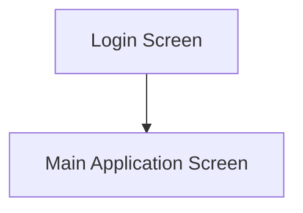
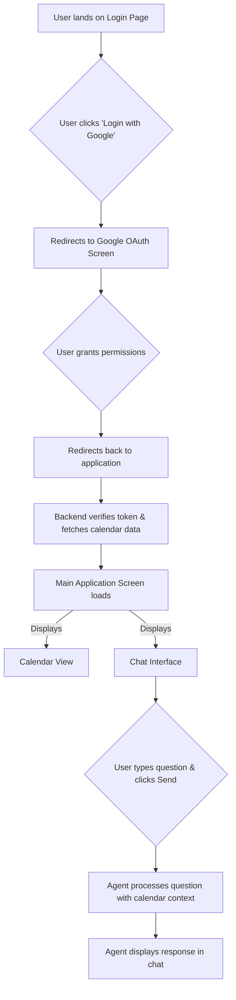
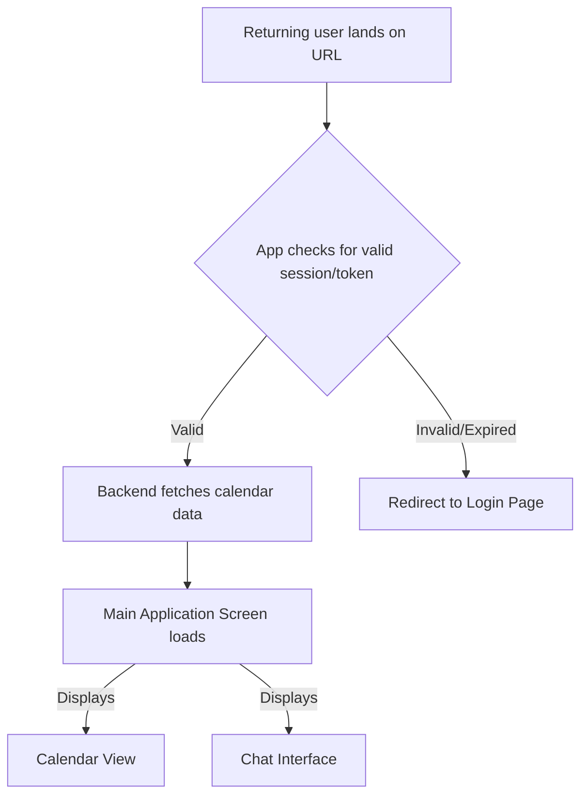

# cal agent UI/UX Specification

## 1. Introduction

This document defines the user experience goals, information architecture, user flows, and visual design specifications for cal agent's user interface. It serves as the foundation for visual design and frontend development, ensuring a cohesive and user-centered experience.

### 1.1. Overall UX Goals & Principles

#### 1.1.1. Target User Personas

*   **Primary User: The Technical Evaluator (Potential Employer)**
    *   **Profile:** Technical recruiters, hiring managers, and senior engineers involved in the hiring process.
    *   **Needs & Goals:** They need to quickly and confidently assess a candidate's practical, real-world coding ability. Their goal is to identify competent developers who can build and integrate modern, complex systems.

#### 1.1.2. Usability Goals

*   **Clarity of Skill Demonstration:** The evaluator can immediately understand the technologies used and the developer's proficiency in integrating them (React, FastAPI, Google Calendar API, LLMs).
*   **Efficiency of Evaluation:** The evaluator can assess the project's core functionality (authentication, data display, chat interaction) in under 5 minutes.
*   **Memorability of Candidate:** The project is impressive and distinct enough to be a memorable, positive talking point during the hiring process.

#### 1.1.3. Design Principles

1.  **Professional & Polished:** The UI should be clean, professional, and visually appealing, leveraging a well-established design system (Material-UI) to signal attention to quality.
2.  **Focus on the Core Functionality:** The design should prioritize and draw attention to the key technical demonstration: the chat interaction with the user's calendar data.
3.  **Provide Clear Feedback:** The application must clearly communicate its state, especially during loading, authentication, and API interactions, to manage user expectations and demonstrate robustness.

### 1.2. Change Log

| Date       | Version | Description                             | Author           |
| :--------- | :------ | :-------------------------------------- | :--------------- |
| 2025-09-02 | 1.0     | Initial draft of the UI/UX Specification. | Sally (UX Expert) |

## 2. Information Architecture (IA)

### 2.1. Site Map / Screen Inventory

The application will consist of two main screens:

*   **Login Screen:** A simple page with a "Login with Google" button.
*   **Main Application Screen:** The core interface, containing the calendar view and the chat agent.

### 2.2. Navigation Structure

*   **Primary Navigation:** None. The application is a single-page experience after login.
*   **Secondary Navigation:** None.
*   **Breadcrumb Strategy:** Not applicable.

## 3. User Flows

### 3.1. Flow: New User Authentication & First Interaction

*   **User Goal:** To securely log in, see their calendar, and successfully get a response from the chat agent.
*   **Entry Points:** Navigating to the application's public URL.
*   **Success Criteria:** The user is logged in, their calendar is displayed, and they have received a relevant response from the agent to their query.

#### 3.1.1. Flow Diagram

#### 3.1.2. Edge Cases & Error Handling:

*   **User denies OAuth permission:** The user should be returned to the login screen with a message explaining that permission is required to use the app.
*   **Google API error:** If the calendar data cannot be fetched, the application should display an error message in the calendar view area, without crashing the entire app.
*   **LLM API error:** If the agent's response fails, the chat interface should show an error message like "Sorry, I couldn't process that request. Please try again."

### 3.2. Flow: Returning User Session

*   **User Goal:** To access the application directly without needing to log in again.
*   **Entry Points:** Navigating to the application's public URL.
*   **Success Criteria:** The application loads directly into the main screen, displaying the user's calendar and the chat interface.

#### 3.2.1. Flow Diagram

#### 3.2.2. Edge Cases & Error Handling:

*   **Expired Token:** If the session token has expired, the user is seamlessly redirected to the Login Page to re-authenticate.
*   **Revoked Permissions:** If the user has revoked the application's access from their Google account settings, the backend will fail to fetch calendar data. The user should be logged out and redirected to the Login Page with a message explaining they need to re-authenticate.

## 4. Wireframes & Mockups

### 4.1. Design Files

*   **Primary Design Source:** The live, deployed application and its source code.
*   **Component Library:** [Material-UI](https://mui.com/)

### 4.2. Key Screen Layouts

#### 4.2.1. Screen: Main Application Screen

*   **Purpose:** To provide the user with a seamless interface to view their calendar and interact with the AI chat agent.
*   **Key Elements:**
    *   A top header with the application title and user/logout information.
    *   A main content area with a two-column layout.
    *   The left column contains the user's calendar (weekly or daily view).
    *   The right column contains the chat interface (chat history and text input).
*   **Interaction Notes:**
    *   The chat interface will show a loading indicator while the agent is processing a request.
    *   The calendar view is read-only.

## 5. Component Library / Design System

### 5.1. Design System Approach

*   **Design System Approach:** The project will use the existing, open-source [Material-UI](https://mui.com/) component library. This aligns with the goal of creating a professional and polished UI efficiently, without creating a new design system from scratch.

### 5.2. Core Components

*   **Component: `AppBar`**
    *   **Purpose:** To serve as the main top navigation bar, containing the application title and user information.
    *   **Usage Guidelines:** A single, primary `AppBar` will be used at the top of the page.

*   **Component: `Button`**
    *   **Purpose:** For all primary actions, including "Login with Google" and "Send" for the chat input.
    *   **Variants:** We will use `contained` buttons for primary actions.
    *   **States:** Will include hover, focus, and disabled states.

*   **Component: `TextField`**
    *   **Purpose:** For the user to input their questions into the chat agent.
    *   **Variants:** The `outlined` variant will be used for a clean, modern look.

*   **Component: `CircularProgress`**
    *   **Purpose:** To be used as a loading indicator within the chat interface while the agent is processing a request.
    *   **Usage Guidelines:** Will be displayed inline in the chat history to provide clear feedback.

## 6. Branding & Style Guide

### 6.1. Visual Identity

*   **Brand Guidelines:** Not applicable. A simple and clean aesthetic will be maintained, consistent with Material-UI's design principles.

### 6.2. Color Palette

| Color Type | Hex Code                                                    | Usage                                                       |
| :--------- | :---------------------------------------------------------- | :---------------------------------------------------------- |
| Primary    | `#1976D2`                                                   | Primary buttons, links, and highlights. (A standard blue)     |
| Secondary  | `#990964`                                                   | Optional secondary actions or highlights. (A standard purple) |
| Accent     | `#FFC107`                                                   | For special highlights or callouts. (A standard amber)      |
| Success    | `#4CAF50`                                                   | Positive feedback, confirmations. (A standard green)        |
| Warning    | `#FF9800`                                                   | Cautions, important notices. (A standard orange)            |
| Error      | `#F44336`                                                   | Errors, destructive actions. (A standard red)               |
| Neutral    | `#FFFFFF`, `#F5F5F5`, `#E0E0E0`, `#9E9E9E`, `#212121` | Backgrounds, borders, and text.                             |

### 6.3. Typography

*   **Font Families:**
    *   **Primary:** "Roboto", sans-serif (The default for Material-UI).
*   **Type Scale:** The default Material-UI type scale will be used to ensure a consistent and legible hierarchy (H1, H2, H3, Body, etc.).

### 6.4. Iconography

*   **Icon Library:** [Material Icons](https://mui.com/material-ui/material-icons/).
*   **Usage Guidelines:** Icons will be used sparingly to enhance clarity for actions like "Send" or "Logout".

### 6.5. Spacing & Layout

*   **Grid System:** The standard 12-column Material-UI grid system will be used for layout.
*   **Spacing Scale:** The standard Material-UI 8px spacing unit will be used for consistent margins and padding.

## 7. Accessibility Requirements

### 7.1. Compliance Target

*   **Standard:** WCAG 2.1 AA. This is a widely accepted standard for web accessibility and is a great target for demonstrating high-quality development.

### 7.2. Key Requirements

*   **Visual:**
    *   **Color contrast ratios:** All text will meet a minimum contrast ratio of 4.5:1 against its background.
    *   **Focus indicators:** All interactive elements (buttons, inputs, links) will have a clearly visible focus state.
    *   **Text sizing:** Users will be able to resize text up to 200% without loss of content or functionality.

*   **Interaction:**
    *   **Keyboard navigation:** All functionality will be operable through a keyboard, without requiring a mouse.
    *   **Screen reader support:** The application will be tested for a logical reading order and proper announcements with screen readers (e.g., VoiceOver, NVDA).
    *   **Touch targets:** All interactive elements will have a target size of at least 44x44 pixels.

*   **Content:**
    *   **Alternative text:** All meaningful images and icons will have descriptive alternative text.
    *   **Heading structure:** Headings will be used semantically to create a logical document structure.
    *   **Form labels:** All form inputs will have clear, programmatically associated labels.

### 7.3. Testing Strategy

*   **Automated Testing:** Use tools like `axe-core` to automatically catch common accessibility violations during development.
*   **Manual Testing:** Perform manual checks,, including keyboard-only navigation and testing with a screen reader, to ensure a good user experience.

## 8. Responsiveness Strategy

### 8.1. Breakpoints

| Breakpoint | Min Width | Target Devices          |
| :--------- | :-------- | :---------------------- |
| Mobile     | 0px       | Phones                  |
| Tablet     | 600px     | Tablets                 |
| Desktop    | 900px     | Desktops, Laptops       |
| Wide       | 1200px    | Large desktop monitors  |

### 8.2. Adaptation Patterns

*   **Layout Changes:**
    *   On **Desktop** screens, the application will use the two-column layout (Calendar on the left, Chat on the right).
    *   On **Mobile** and **Tablet** screens, the two columns will stack vertically: the Calendar view will appear first, and the Chat interface will appear below it.
*   **Navigation Changes:** The top `AppBar` will remain consistent across all breakpoints, with its contents adapting gracefully to the available space.
*   **Content Priority:** On smaller screens, the Calendar view is prioritized to appear first, as it provides the context for the chat interaction that follows.
*   **Interaction Changes:** No major interaction changes are expected across breakpoints. Touch targets will be large enough for mobile users as defined in the accessibility section.

## 9. Animation & Micro-interactions

### 9.1. Motion Principles

*   **Principle:** Animations should be subtle, quick, and meaningful. They should provide feedback for user actions, not distract from the core functionality.

### 9.2. Key Animations

*   **Animation: Button Ripple**
    *   **Description:** A ripple effect that emanates from the user's click on a button. This is a standard Material Design interaction that provides clear feedback.
    *   **Duration & Easing:** Handled by the default Material-UI `Button` component.

*   **Animation: Focus Indicator**
    *   **Description:** A subtle transition for the outline or background of an element when it receives focus (e.g., when a user tabs to a button or input field).
    *   **Duration & Easing:** Handled by the default Material-UI components.

*   **Animation: Fade In/Out**
    *   **Description:** The loading indicator in the chat interface will gently fade in and out, rather than appearing and disappearing abruptly.
    *   **Duration & Easing:** A simple, quick fade (e.g., 200ms, linear).

## 10. Performance Considerations

### 10.1. Performance Goals

*   **Page Load:** The initial application load time should be under 3 seconds on a standard broadband connection.
*   **Interaction Response:** Responses to user interactions (e.g., clicks, typing) should feel instantaneous (<100ms). LLM agent responses should be displayed as soon as they are available, with a clear loading state in the meantime.
*   **Animation FPS:** All animations should maintain a smooth 60 frames per second.

### 10.2. Design Strategies

*   **Code Splitting:** The application will be bundled and code-split by default (a feature of modern React frameworks) to ensure only the necessary JavaScript is loaded for the initial page view.
*   **Lazy Loading:** Non-critical assets will be loaded lazily where appropriate.
*   **Optimized API Calls:** The application will only fetch calendar data when necessary and will display loading states to manage user expectations during API calls to Google Calendar and the LLM.

## 11. Next Steps

### 11.1. Immediate Actions

1.  **Review and Finalize:** Share this UI/UX Specification with stakeholders (in this case, the project owner) for final approval.
2.  **Begin Frontend Development:** Start building the React application based on the specifications in this document, using the Material-UI component library.
3.  **Implement Authentication:** The first development priority is to implement the Google OAuth 2.0 flow.

### 11.2. Design Handoff Checklist

*   [x] All user flows documented
*   [x] Component inventory complete
*   [x] Accessibility requirements defined
*   [x] Responsive strategy clear
*   [x] Brand guidelines incorporated
*   [x] Performance goals established
