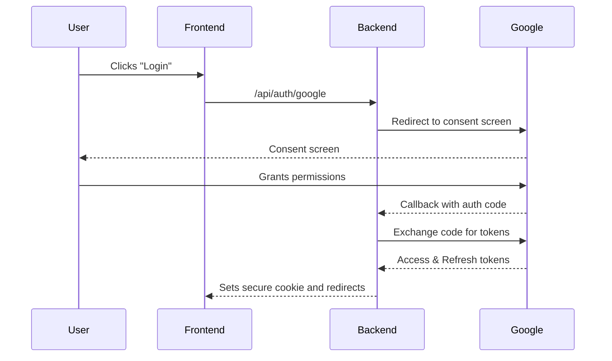

# Backend Architecture

## Service Architecture

### Serverless Architecture

#### Function Organization
```
api/
├── index.py            # Main entry point for the FastAPI app
├── auth/
│   └── routes.py       # Authentication routes
├── calendar/
│   └── routes.py       # Calendar routes
├── chat/
│   └── routes.py       # Chat routes
└── core/
    ├── security.py     # Security-related functions
    └── services.py     # Business logic
```

#### Function Template
```python
from fastapi import APIRouter

router = APIRouter()

@router.get("/my-endpoint")
async def my_endpoint():
    # function logic
    return {"message": "Hello from my endpoint"}
```

## Database Architecture
As stated previously, a database is not required for the MVP of this project.

## Authentication and Authorization

### Auth Flow


#### Middleware/Guards
```python
from fastapi import Request, Depends, HTTPException
from fastapi.security import HTTPBearer

oauth2_scheme = HTTPBearer()

async def get_current_user(request: Request, token: str = Depends(oauth2_scheme)):
    # In a real app, you would validate the token and get the user
    # For this example, we'll assume the token is a user ID
    if not request.session.get('user'):
        raise HTTPException(status_code=401, detail="Not authenticated")
    return request.session.get('user')
```
