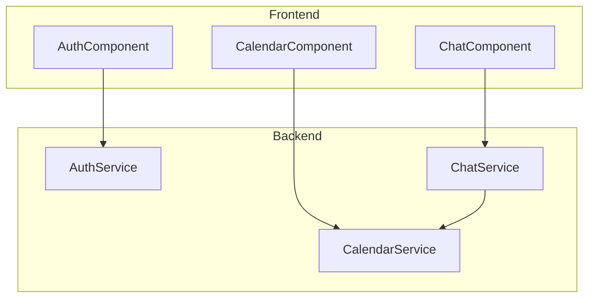

# Components

## Frontend: AuthComponent

**Responsibility:** Manages the user's authentication state and provides the login/logout UI.
**Key Interfaces:** Renders a "Login with Google" button or a "Logout" button depending on the user's auth state.
**Dependencies:** `Backend: AuthService`
**Technology Stack:** React, Material-UI

## Frontend: CalendarComponent

**Responsibility:** Fetches and displays the user's calendar events.
**Key Interfaces:** Renders a calendar view.
**Dependencies:** `Backend: CalendarService`
**Technology Stack:** React, Material-UI

## Frontend: ChatComponent

**Responsibility:** Provides the main chat interface for the user to interact with the agent.
**Key Interfaces:** Renders the chat history, a text input, and a send button.
**Dependencies:** `Backend: ChatService`
**Technology Stack:** React, Material-UI

## Backend: AuthService

**Responsibility:** Handles the Google OAuth 2.0 flow, manages user sessions, and securely stores refresh tokens.
**Key Interfaces:** Exposes the `/auth/google`, `/auth/google/callback`, and `/auth/logout` endpoints.
**Dependencies:** Google OAuth, Google Cloud Secret Manager
**Technology Stack:** FastAPI

## Backend: CalendarService

**Responsibility:** Fetches calendar events from the Google Calendar API using the user's stored credentials.
**Key Interfaces:** Exposes the `/calendar/events` endpoint.
**Dependencies:** Google Calendar API
**Technology Stack:** FastAPI

## Backend: ChatService

**Responsibility:** Takes user input, combines it with calendar data, and interacts with the Google Gemini LLM to generate a response.
**Key Interfaces:** Exposes the `/chat` endpoint.
**Dependencies:** Google Gemini API, `Backend: CalendarService`
**Technology Stack:** FastAPI

## Component Diagram

