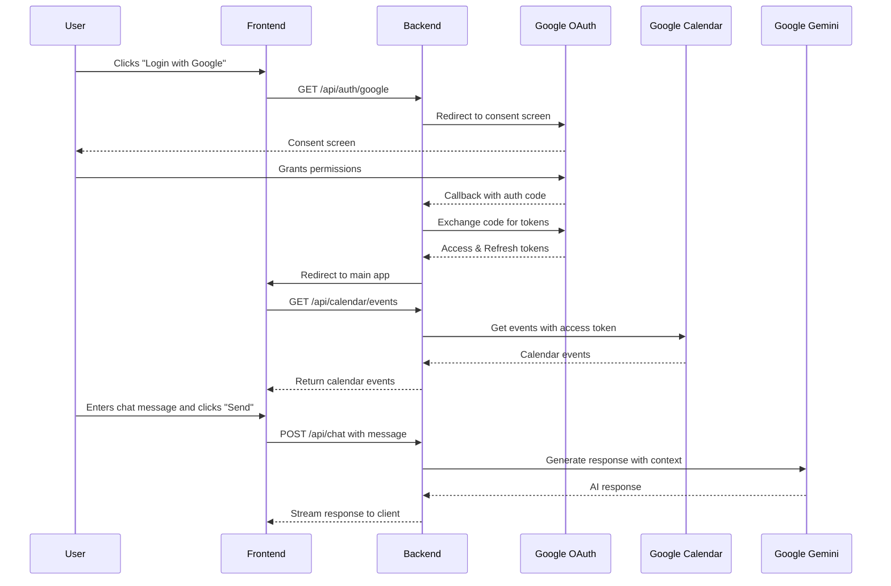

# Core Workflows

This diagram shows the sequence of events for a new user authenticating and interacting with the chat agent for the first time.

```mermaid
sequenceDiagram
    participant User
    participant Frontend
    participant Backend
    participant Google OAuth
    participant Google Calendar
    participant Google Gemini

    User->>Frontend: Clicks "Login with Google"
    Frontend->>Backend: GET /api/auth/google
    Backend->>Google OAuth: Redirect to consent screen
    Google OAuth-->>User: Consent screen
    User->>Google OAuth: Grants permissions
    Google OAuth-->>Backend: Callback with auth code
    Backend->>Google OAuth: Exchange code for tokens
    Google OAuth-->>Backend: Access & Refresh tokens
    Backend->>Frontend: Redirect to main app
    Frontend->>Backend: GET /api/calendar/events
    Backend->>Google Calendar: Get events with access token
    Google Calendar-->>Backend: Calendar events
    Backend-->>Frontend: Return calendar events
    User->>Frontend: Enters chat message and clicks "Send"
    Frontend->>Backend: POST /api/chat with message
    Backend->>Google Gemini: Generate response with context
    Google Gemini-->>Backend: AI response
    Backend-->>Frontend: Stream response to client
```
