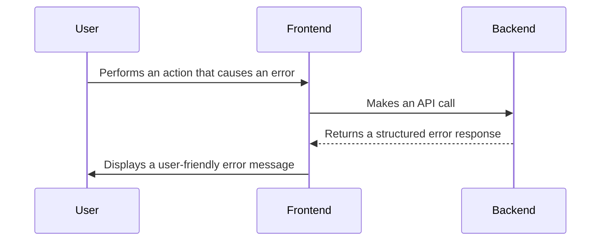

# Error Handling Strategy

## Error Flow


## Error Response Format
```typescript
interface ApiError {
  error: {
    code: string;
    message: string;
    details?: Record<string, any>;
    timestamp: string;
    requestId: string;
  };
}
```

## Frontend Error Handling
```typescript
import { useState } from 'react';
import { getCalendarEvents } from './services';

const Calendar: React.FC = () => {
  const [error, setError] = useState<string | null>(null);

  const fetchEvents = async () => {
    try {
      const events = await getCalendarEvents();
      // ...
    } catch (err) {
      setError('Failed to fetch calendar events.');
    }
  };

  // ...
};
```

## Backend Error Handling
```python
from fastapi import FastAPI, Request, status
from fastapi.responses import JSONResponse

app = FastAPI()

@app.exception_handler(Exception)
async def global_exception_handler(request: Request, exc: Exception):
    return JSONResponse(
        status_code=status.HTTP_500_INTERNAL_SERVER_ERROR,
        content={
            "error": {
                "code": "INTERNAL_SERVER_ERROR",
                "message": "An unexpected error occurred.",
            }
        },
    )
```
