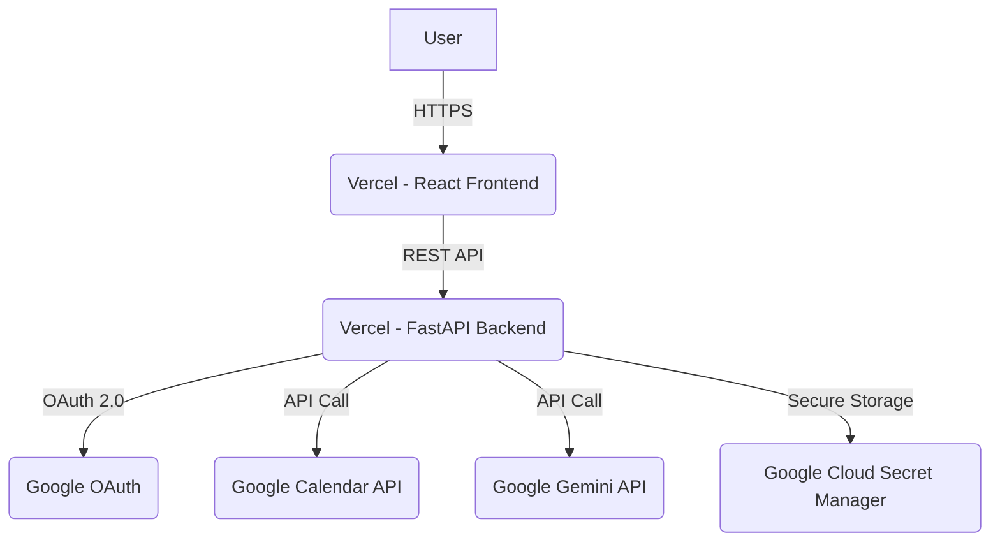

# High Level Architecture

## Technical Summary
The "cal agent" project will be a full-stack application with a decoupled front-end and back-end, deployed on a serverless infrastructure to meet the NFR of minimal budget. The front-end will be a React application using Material-UI, and the back-end will be a Python application using the FastAPI framework. The key integration point is a REST API that the front-end will use to communicate with the back-end for authentication, calendar data, and chat functionality. The entire application will be hosted on Vercel, which provides a seamless deployment experience for Next.js/React front-ends and serverless back-end functions. This architecture directly supports the PRD goals by demonstrating proficiency in modern, decoupled web architectures, API design, and AI integration.

## Platform and Infrastructure Choice
**Platform:** Vercel
**Key Services:** Vercel for hosting the front-end and serverless back-end, Google Cloud Secret Manager for storing refresh tokens.
**Deployment Host and Regions:** Vercel's standard CDN and serverless functions deployed in a single region (e.g., `us-east-1`).

## Repository Structure
**Structure:** Monorepo
**Monorepo Tool:** Turborepo
**Package Organization:** The monorepo will contain `apps/web` for the React front-end, `apps/api` for the FastAPI back-end, and `packages/shared` for shared TypeScript types.

## High Level Architecture Diagram

## Architectural Patterns
- **Serverless Architecture:** The backend will be deployed as serverless functions on Vercel. _Rationale:_ This aligns with the NFR of minimal budget by using a pay-per-use model and simplifies deployment and scaling.
- **Component-Based UI:** The React front-end will be built using reusable components with Material-UI. _Rationale:_ This promotes maintainability, consistency, and faster development.
- **API Gateway Pattern:** The FastAPI application will act as a single entry point for all API calls from the front-end. _Rationale:_ This centralizes authentication, request handling, and provides a clear contract between the front-end and back-end.
